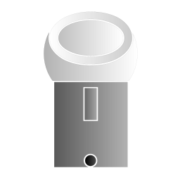

# homebridge-dyson-bp01 [](https://github.com/homebridge/homebridge/wiki/Verified-Plugins)

## About

This Homebridge plugin adds a Dyson BP01 fan to HomeKit using a BroadLink RM.

## Purpose

There are currently plugins out there that can use a BroadLink RM to control many other devices; however, they break if
you try to change more than one characteristic of an accessory at once. This plugin aims to fix this issue to bring a
more native HomeKit experience to the IR-controlled Dyson BP01.

## Required Hardware

This plugin is designed to be used with the following devices:

- A BroadLink RM supported by [this library](https://github.com/kiwi-cam/broadlinkjs-rm)
- A Dyson BP01

## Hardware Setup

### BroadLink RM Setup

1. Set up your BroadLink RM with the BroadLink app.
    1. For standard setup, follow the full setup process within the app. Then, in device properties,
       disable `Lock device`.
    2. For local network setup, follow the in-app setup, but stop at the "Add Devices" page. Do not continue the setup
       process, and close the app.
2. Place the device so that it has a direct line of sight to the fan's display.

### Dyson BP01 Setup

Using the remote provided with the fan:

1. Set the fan speed to 1.
2. Turn off oscillation.
3. Turn off the fan.

## Required Software

- Node.js 14.0.0 or higher
- Homebridge 1.3.0 or higher

## Building

You can build the project by doing the following:

1. Clone or download this repository.
2. Run `npm run build` in the folder of the repository.

## Installation

There are multiple ways to install this plugin:

- Search for `homebridge-dyson-bp01` in the Homebridge UI and click `Install` on this plugin.
- Run `hb-service add homebridge-dyson-bp01` through the Homebridge terminal.
- Run `npm install homebridge-dyson-bp01` through the Homebridge terminal.
- Run `npm install path/to/project` through the Homebridge terminal if you built the project.

After any of these, restart Homebridge.

## Configuration

It is recommended that you use the Homebridge UI to configure this plugin. Otherwise, add the following
under `accessories` in the Homebridge config:

```json
{
    "accessory": "DysonBP01",
    "name": "Dyson Pure Cool Me",
    "serialNumber": "XXX-XX-XXXXXXXX",
    "macAddress": "XX:XX:XX:XX:XX:XX",
    "exposeSensors": false
}
```

- `accessory` is required. This must be set to "DysonBP01" for the plugin to work.
- `name` is required. You will need to redo the Dyson BP01 hardware setup if you change this later.
- `serialNumber` is required. Set this to the serial number of your Dyson BP01 to include it in accessory information.
- `macAddress` is optional, but recommended if you have multiple BroadLink RMs, so the plugin can use the right one.
- `exposeSensors` is required. Set to true if your BroadLink RM has the sensor cable to expose the temperature and
  humidity sensors.

Restart Homebridge after changing any of these settings for them to take effect.

## Demonstration

<div align="center"></div>

## Troubleshooting

- If your BroadLink RM randomly stops working or does not reconnect after power loss, try assigning it a static IP
  address.
- If not all signals are sending, check the position of your BroadLink RM and ensure it has a direct line of sight to
  the fan's display.
- If the fan ever de-syncs from Homebridge/HomeKit, use the physical remote to change its state to re-sync it.